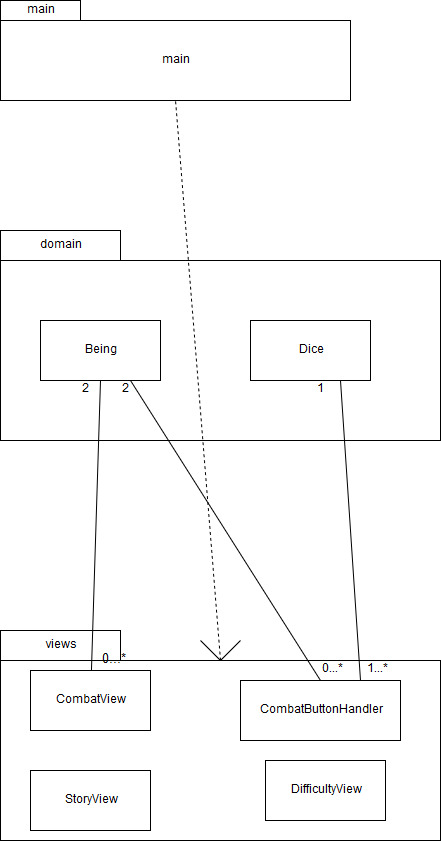

# Arkkitehtuurikuvaus

## Rakenne
Ohjelman koodi on jaettu kolmeen tasoon, jossa main (ui) ja views pakkaukset luovat sovelluksen käyttöliittymän, ja domain pakkauksessa luodaan pelin toiminnalle olennaiset "työkalut".

## Käyttöliittymä
Käyttöliittymä sisältää monta erilaista näkymää, joka on kaikki toteutettu omana Scene-olionaan. Käyttöliittymä on rakennettu ohjelmallisesti luokassa rpgame.main.Main pakkauksesta rpgame.views löytyvien luokkien avulla. 

## Sovelluslogiikka
Alla kaavio joka kuvaa sovelluksen osien suhteita toisiinsa

## Toiminnallisuuksia
Alla kaavio joka kuvaa kuinka pelaajalle saadaan näkymään oikea teksti yhden "taisteluvuoron" jälkeen.

## Ohjelman rakenteeseen jääneet heikkoudet
* Se vähä sovelluslogiikka mitä löytyy on ikävästi edelleen myös ui luokissa esillä (esim. main-luokassa vertaillaan olioiden attribuutteja nappien painalluksien yhteydessä).
